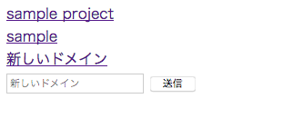
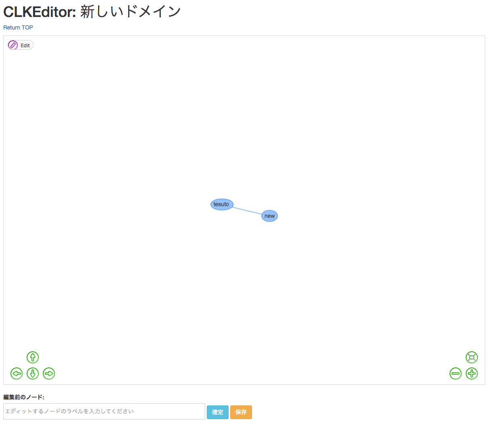

# clkedit - Common Lisp network style Knowledge graph EDITor with vis.js and sqlite -

## Installation & Usage

### Install clkedit via roswell

```
~ $ ros install dbym4820/utsushiyo
.
.
.
~ $ ros install dbym4820/clkedit
.
.
.
~ $ clkedit
Open localhost:26262 on your browser
```

### Open clkedit on your browser

http://localhost:26262


### Image

#### Network select window



#### Network edit window


